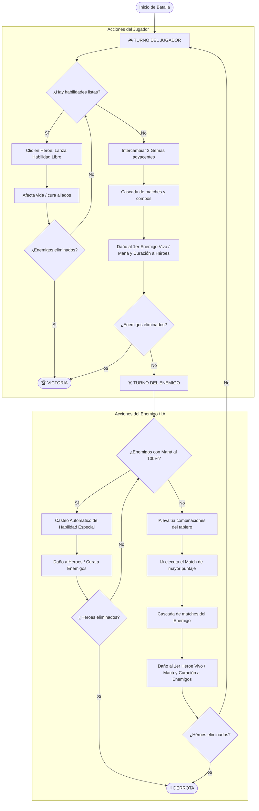

# ⚔️ Manual Detallado de Mecánicas de Combate (Match-3) - Chronowar

Este manual documenta en profundidad el funcionamiento del motor de combate basado en Match-3 implementado en el componente principal de batalla (`Battlefield.tsx`). Aquí se explican las fórmulas matemáticas, interacción de estadísticas (Vida, Ataque, Defensa), efectos especiales y la lógica de inteligencia artificial.

---

## 1. Tipos de Gemas y Efectos de Raza

El tablero de combate consiste en una cuadrícula de **8x8** que genera aleatoriamente gemas asociadas a las 4 razas del juego. Emparejar 3 o más gemas del mismo tipo desata efectos específicos para tu equipo (en tu turno) o para el enemigo (en su turno):

| Raza / Gema | Icono | Daño Base por Gema | Maná Ganado por Gema | Curación por Gema | Descripción del Rol de Combate |
| :--- | :---: | :---: | :---: | :---: | :--- |
| **Gorkar (Furia)** | 🔥 | **35** | 5 | 0 | **Ofensiva pura.** Ideal para infligir gran cantidad de daño directo rápidamente. |
| **Mortharim (Muerte)** | 💀 | **25** | **20** | 0 | **Generador de Maná.** Ofrece buen daño y es clave para cargar las habilidades rápido. |
| **Valdari (Luz)** | ⚡ | **20** | 10 | 0 | **Balanceada.** Ofrece daño moderado y recarga de maná estándar. |
| **Sylvaran (Bosque)** | 🌿 | **0** | 15 | **25** | **Defensiva/Sustento.** No daña, pero cura la vida del equipo y aporta buen maná. |

---

## 2. Multiplicadores por Tamaño de Match

Conectar más de 3 gemas premia al jugador con efectos exponenciales de daño/curación y la creación de gemas con poderes explosivos:

* **Match de 3:** Multiplicador base de **1.0x** en sus efectos.
* **Match de 4:** Multiplicador de **1.5x** en sus efectos. Además, genera una **Gema de Poder (✨)** en el centro del match.
* **Match de 5 o más:** Multiplicador de **2.2x** en sus efectos. Además, genera una **Gema de Rayo (⚡)** en el centro del match.

---

## 3. Gemas Especiales de Tablero

Cuando una de estas gemas especiales forma parte de un match, detona desatando una destrucción masiva que absorbe más gemas y las suma a los efectos del turno:

### ✨ Gema de Poder (Power Gem)
* **Activación:** Se crea al unir 4 gemas.
* **Efecto de Explosión:** Explota en una **cuadrícula de 3x3** alrededor de ella. Las 8 gemas vecinas son destruidas de inmediato, y sus efectos correspondientes (daño, maná o curación) se acumulan al daño total del turno.

### ⚡ Gema de Rayo (Lightning Gem)
* **Activación:** Se crea al unir 5 o más gemas.
* **Efecto de Explosión:** Al explotar, dispara un rayo en cruz que **destruye toda la fila y toda la columna** donde se encuentra. Esto genera cascadas gigantescas de nuevas gemas.

---

## 4. El Sistema de Combo y Multiplicador de Cascadas

Cuando se realiza un movimiento que destruye gemas, estas caen y rellenan los huecos vacíos. Si la caída de nuevas gemas produce matches de forma automática, se inicia una **cascada** que incrementa el nivel de **Combo**.

Cada nivel de combo sucesivo multiplica el impacto de todas las gemas destruidas en esa secuencia:

$$\text{Multiplicador de Combo} = 1 + (\text{Nivel de Combo} \times 0.32)$$

* **Primer Match (Combo 1):** Multiplicador de **1.0x**
* **Primer Reajuste (Combo 2):** Multiplicador de **1.32x**
* **Segundo Reajuste (Combo 3):** Multiplicador de **1.64x** (Activa temblor de pantalla `doShake()`)
* **Tercer Reajuste (Combo 4):** Multiplicador de **1.96x**

> **Límite de Balance:** Para evitar que un combo infinito cargue el 100% de la barra de habilidades de una sola vez, la ganancia de maná máxima por cascada está limitada a **40 de maná**.

---

## 5. Interacción de Estadísticas: Vida, Ataque y Defensa

Cada héroe y enemigo posee tres atributos principales que interactúan directamente con los resultados de los matches del tablero:

* **Vida (HP):** Representa la salud de la unidad. Si llega a 0, la unidad muere (`isDead = true`), su tarjeta se oscurece y no puede participar más.
* **Ataque (ATK):** Determina la potencia de las habilidades especiales basadas en daño.
* **Defensa (DEF):** Es un escudo plano que **resta de forma directa** cualquier impacto recibido (sea de matches o habilidades especiales).

### 🧮 Fórmula del Daño Mitigado por Defensa
$$\text{Daño Realizado} = \max(1, \text{Daño Bruto Acumulado} - \text{Defensa del Objetivo})$$

> La mitigación por defensa nunca puede reducir el daño a 0; cualquier golpe exitoso infligirá como mínimo **1 de daño**.

---

## 6. Mecánica del Turno del Jugador

Durante tu turno, el combate se rige por las siguientes reglas operativas:

### A. Dirección del Daño
Todo el daño de ataque acumulado en tu cascada de gemas se inflige al **primer enemigo vivo de izquierda a derecha** (el tanque enemigo). Una vez derrotado, el exceso de daño de futuros turnos pasará al siguiente enemigo vivo.

### B. Carga de Furia Enemiga (Rage)
Los enemigos no se quedan quietos al recibir tus golpes. Cada vez que atacas a un enemigo con gemas, este acumula maná de furia en su barra morada:
$$\text{Furia Ganada por Enemigo} = \min\left(18, \left\lfloor\frac{\text{Daño Recibido}}{7}\right\rfloor\right)$$
*Golpear demasiado fuerte con matches normales provocará que los enemigos carguen sus temibles habilidades especiales mucho más rápido.*

### C. Habilidades de Héroes (¡Acción Libre! ⚔️)
El maná acumulado por las gemas de maná se distribuye por igual a todos los héroes vivos (el máximo es 100). Cuando un héroe brilla con maná completo, puedes hacer clic en él para desatar su habilidad:

1. **Héroe 1 - Golpe Crítico:** Causa **$3 \times$ el Ataque del Héroe** al enemigo vivo que tenga menos HP (perfecto para rematar).
2. **Héroe 2 - Escudo Divino:** Cura **80 HP** a todos tus héroes aliados vivos.
3. **Héroe 3 - Devastación:** Inflige **60 de daño bruto** (mitigado por defensa) a **todos** los enemigos vivos.
4. **Héroe 4 - Lluvia de Flechas:** Causa **45 de daño bruto** a 3 enemigos aleatorios.
5. **Héroe 5 - Sanación Mayor:** Cura **120 HP** al héroe aliado que tenga el menor porcentaje de vida actual.

> **La Habilidad es una Acción Libre:** Utilizar una habilidad especial lista **no consume tu movimiento**. Puedes lanzar todas las habilidades de tus héroes que estén listas, ver sus efectos en pantalla y luego proceder a mover gemas en el tablero para finalizar tu turno.

---

## 7. Mecánica del Turno del Enemigo e Inteligencia Artificial (IA)

Una vez que realizas tu movimiento y las gemas dejan de caer, el juego pasa a la fase del enemigo:

### Paso 1: Lanzamiento de Habilidades Especiales Enemigas
Antes de realizar cualquier movimiento en el tablero, **todos los enemigos que tengan su barra de maná al 100% lanzan automáticamente su habilidad especial** en orden, afectando a tus héroes:
* **Berserker (Furia Berserker):** Golpea a 2 héroes aleatorios con **1.5x de su Ataque**.
* **Machacador (Aplastamiento):** Inflige **90 de daño bruto** al héroe vivo con mayor vida actual.
* **JEFE (Grito de Guerra):** Golpea a **todos** tus héroes vivos infligiendo **40 de daño bruto**.
* **Chamán (Curación Tribal):** Cura **60 HP** a todos los enemigos vivos.
* **Raider (Emboscada):** Ejecuta 3 golpes rápidos consecutivos de **25 de daño bruto** a héroes aleatorios.

### Paso 2: Análisis y Movimiento del Tablero de la IA
La inteligencia artificial evalúa cada posible movimiento (intercambio adyacente) en el tablero. Calcula un puntaje de prioridad para cada movimiento utilizando sus preferencias raciales:

$$\text{Prioridad de Raza (Peso)} = \begin{cases} 
3.5 & \text{Gorkar (Fuego)} \\ 
2.8 & \text{Sylvaran (Bosque)} \\ 
2.3 & \text{Mortharim (Muerte)} \\ 
1.6 & \text{Valdari (Luz)} 
\end{cases}$$

$$\text{Puntaje del Movimiento} = \text{Longitud del Match}^2 \times \text{Prioridad de Raza}$$

La IA ejecuta el intercambio que ofrezca el **Puntaje de Movimiento más alto**.
* **Daño al Jugador:** Las gemas de ataque emparejadas por el enemigo dañan al **primer héroe vivo** de tu formación.
* **Curación Enemiga:** Si la IA empareja gemas Sylvaran (Bosque), **cura a todos los enemigos vivos** en lugar de a tus héroes.
* **Maná Enemigo:** Si empareja gemas de maná, **todos los enemigos vivos ganan el 65% del maná total acumulado**.

---

## 8. Flujo del Turno de Combate

